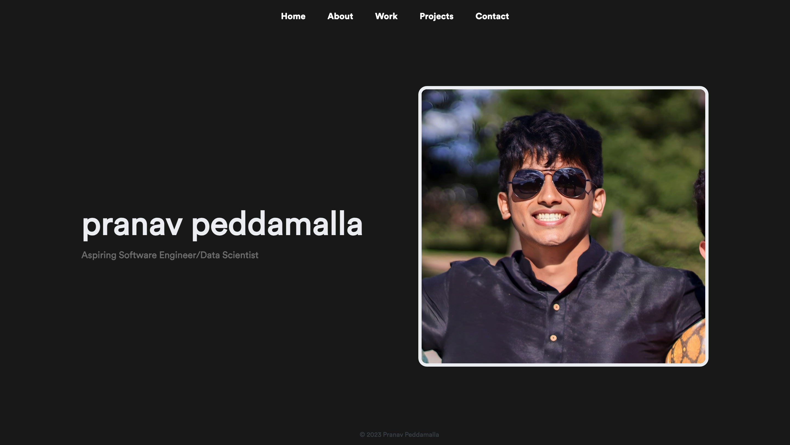

# Personal Website

This repo is where you'll find the source code for my personal website, which is a showcase of my skills in JavaScript, HTML, CSS, EJS, Node.js, and Express.js. It's a full-on display of what I can do, covering everything from my skill set and work experience to a bunch of personal projects, with this website being a standout example. It's not just about showing off my technical skills, though – it's also a neat summary of my journey and accomplishments in software development.

(In the future I plan to change the sites implementation to a fully React based site but for now I wanted to get the basic site up and running)

Feel free to reach out as I would be more than happy to hear any feedback regarding areas of improvement!

Link to site: (insert link here)
